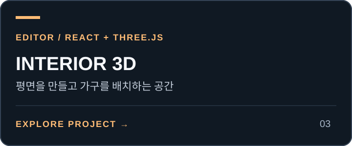

# Seoul Air Tour Viewer

<!-- PROJECT-LINKS:START -->
## 3D Playground

게임·공간·아바타를 한곳에서. 카드를 누르면 저장소로, 아래 버튼을 누르면 공개 데모 또는 실행 안내로 이동합니다.

<table>
<tr>
<td width="50%" valign="top">
<a href="https://github.com/minwoo19930301/seoul-flight-game"></a><br>
<a href="https://minwoo19930301.github.io/seoul-flight-game/"></a>
<a href="https://github.com/minwoo19930301/seoul-flight-game/pulls"></a><br>
<sub>중심 서울 일부 · 일반 건물 높이·외장 추정</sub><br>
<sub><a href="https://github.com/minwoo19930301/seoul-flight-game">저장소</a> · <a href="https://github.com/minwoo19930301/seoul-flight-game/pull/1">병합된 개선 PR #1</a></sub>
</td>
<td width="50%" valign="top">
<a href="https://github.com/minwoo19930301/parking-master-webasm"></a><br>
<a href="https://parking-master-webasm.vercel.app/"></a>
<a href="https://github.com/minwoo19930301/parking-master-webasm/pulls"></a><br>
<sub>공개 데모는 이전 버전 · 최신 소스는 저장소</sub><br>
<sub><a href="https://github.com/minwoo19930301/parking-master-webasm">저장소</a> · <a href="https://github.com/minwoo19930301/parking-master-webasm/pull/2">병합된 개선 PR #2</a></sub>
</td>
</tr>
<tr>
<td width="50%" valign="top">
<a href="https://github.com/minwoo19930301/interior3d"></a><br>
<a href="https://minwoo19930301.github.io/interior3d/"></a>
<a href="https://github.com/minwoo19930301/interior3d/pulls"></a><br>
<sub>공개 데모는 이전 버전 · 19종 모델은 최신 소스</sub><br>
<sub><a href="https://github.com/minwoo19930301/interior3d">저장소</a> · <a href="https://github.com/minwoo19930301/interior3d/pull/1">병합된 개선 PR #1</a></sub>
</td>
<td width="50%" valign="top">
<a href="https://github.com/minwoo19930301/animal-metaverse"></a><br>
<a href="https://minwoo19930301.github.io/animal-metaverse/"></a>
<a href="https://github.com/minwoo19930301/animal-metaverse/pulls"></a><br>
<sub>3D 3종 + 2D 3종 · 아래에서 바로 선택</sub><br>
<sub><a href="https://github.com/minwoo19930301/animal-metaverse">저장소</a> · <a href="https://github.com/minwoo19930301/animal-metaverse/pull/1">병합된 개선 PR #1</a></sub>
</td>
</tr>
<tr>
<td width="50%" valign="top">
<a href="https://github.com/minwoo19930301/flamingo-chess"></a><br>
<a href="https://minwoo19930301.github.io/flamingo-chess/"></a>
<a href="https://github.com/minwoo19930301/flamingo-chess/pulls"></a><br>
<sub>플라밍고 vs 흑조 · AI 대국</sub><br>
<sub><a href="https://github.com/minwoo19930301/flamingo-chess">저장소</a> · <a href="https://github.com/minwoo19930301/flamingo-chess/pull/1">병합된 개선 PR #1</a></sub>
</td>
<td width="50%" valign="top">
<a href="https://github.com/minwoo19930301/animal-hood-girl-vtuber"></a><br>
<a href="https://github.com/minwoo19930301/animal-hood-girl-vtuber#실행"></a>
<a href="https://github.com/minwoo19930301/animal-hood-girl-vtuber/pulls"></a><br>
<sub>macOS 로컬 앱 · 웹 플레이 링크 없음</sub><br>
<sub><a href="https://github.com/minwoo19930301/animal-hood-girl-vtuber">저장소</a> · <a href="https://github.com/minwoo19930301/animal-hood-girl-vtuber/pull/1">병합된 개선 PR #1</a></sub>
</td>
</tr>
</table>

### ANIMALVERSE · 여섯 세계 바로가기

<p>
<a href="https://minwoo19930301.github.io/animal-metaverse/versions/3d/"></a>
<a href="https://minwoo19930301.github.io/animal-metaverse/versions/3d-r3f/"></a>
<a href="https://minwoo19930301.github.io/animal-metaverse/versions/3d-babylon/"></a>
<a href="https://minwoo19930301.github.io/animal-metaverse/versions/2d-pixel/"></a>
<a href="https://minwoo19930301.github.io/animal-metaverse/versions/2d-pastel/"></a>
<a href="https://minwoo19930301.github.io/animal-metaverse/versions/2d-iso/"></a>
</p>

<sub>2026-09-07 확인: 공개 데모 5곳과 ANIMALVERSE 세부 경로 6곳은 HTTP 응답 확인. 화면·조작 검증을 뜻하지 않습니다. 위 개선 PR 6개는 병합됐습니다. Interior3D 공개 데모는 이전 배포이며, Driving Practice 공개 데모의 최신 확장 반영도 확인되지 않았습니다. “최신 PR”에는 병합 전 변경이 포함될 수 있습니다.</sub>

<!-- PROJECT-LINKS:END -->

[](https://minwoo19930301.github.io/seoul-flight-game/)


서울 실제 도로, 한강, 주행 경로, 건물 풋프린트 데이터를 바탕으로 만든 1인칭 서울 상공 비행 뷰어입니다. HUD와 미니맵으로 주요 랜드마크 방향을 보면서 63빌딩, 경복궁, N서울타워, COEX, 롯데월드타워 순서로 천천히 둘러볼 수 있습니다.

기존 PR #1은 병합됐습니다. 현재 모델은 실제 미터 좌표·DEM 지형·Blender 랜드마크5종·건물69,716동을 포함하지만, **서울 전역이 아닌 약16.8 × 10.0km의 중심 구역**입니다. 일반 건물 높이·외장은 추정이며, 사진 측량 또는 현장과 동일한 복제품이 아닙니다. [모델·높이·지형 출처](docs/reconstruction.md)와 [서울 전역 재구성에 필요한 자료](docs/full-seoul-data.md)를 확인하세요.

## Links

- Live site: [Seoul Air Tour Viewer](https://minwoo19930301.github.io/seoul-flight-game/)
- GitHub: [minwoo19930301/seoul-flight-game](https://github.com/minwoo19930301/seoul-flight-game)

## How To Use

1. 사이트를 열고 시작 패널에서 `둘러보기 시작`을 누릅니다.
2. 화면을 클릭하면 마우스 기준으로 시점과 진행 방향을 조종할 수 있습니다.
3. HUD에서 속도, 고도, 방위, 현재 목표 랜드마크를 확인합니다.
4. 미니맵과 거리 표시를 보면서 다음 랜드마크 방향으로 이동합니다.
5. 필요하면 `R`로 처음 위치로 돌아가 다시 시작합니다.

## Features

- 실제 서울 도로/하천/주행 경로/건물 풋프린트 데이터 기반 미니맵 + 지면 텍스처
- 실제 OSM 건물 약 6.9만 동(아파트/주거 포함) 기반 3D 배치
- 실제 OSM 래스터 타일 기반 바닥/미니맵
- 랜드마크 순서 안내: `63빌딩 -> 경복궁 -> N서울타워 -> COEX -> 롯데월드타워`
- 1인칭 조종석 HUD 오버레이
- 속도, 고도, 방위, 목표 거리 표시
- 마우스 + 키보드 + 모바일 터치 조작 지원
- 지면/건물 충돌 없이 서울 상공을 천천히 둘러보는 비행 뷰어

## Controls

- 화면 클릭: 포인터 락 및 마우스 시점/방향 조종
- `W/S` 또는 `ArrowUp/ArrowDown`: 느리게 상승/하강
- `A/D` 또는 `ArrowLeft/ArrowRight`: 좌우 선회 (기울기와 진행 방향이 함께 바뀝니다)
- `Q/E`: 보조 러더
- `Shift`: 가속
- `Space`: 수평 복귀
- `R`: 처음 위치
- `P` 또는 `Esc`: 일시정지, `P` 또는 `Enter`: 이어서 비행
- 모바일: `기수 +/-`, `좌뱅크`, `우뱅크`, `러더`, `BOOST`, `LEVEL` 버튼 지원

다른 창이나 탭으로 이동하면 자동으로 일시정지하며, 돌아온 뒤 `이어서 비행`을
누르면 위치와 진행 상황이 유지됩니다. 미니맵의 번호 순서대로 이동하고 HUD의
목표 고도에 맞추면 방문으로 기록됩니다. 5곳을 모두 방문하면 완료 화면에서
다시 시작할 수 있습니다. 속도는 시뮬레이션 이동량을 km/h로 환산한 값이며,
고도·거리는 이제 같은 물리 미터 단위를 사용합니다. 고도는 과거 DEM 자료의 근사 기준이며 실측 비행 고도가 아닙니다. 전체 안내 경로는 정상속도로 약5분 이상 걸립니다.

## Run

```bash
python3 -m http.server 5174 --bind 127.0.0.1
```

브라우저: `http://127.0.0.1:5174`

저장소 루트에서 실행합니다. 외부 빌드 단계 없이 정적 파일을 제공합니다.

## Verify

```bash
npm ci
npm test
npm run test:assets
npx playwright install chromium
npm run test:browser
```

단위 테스트는 나침반/Three.js 회전 방향, 선회·수평 복귀, 복수 키·터치 입력을
확인합니다. 브라우저 테스트는 임시 로컬 서버를 직접 띄워 실제 WebGL 시작,
키보드 조향, 일시정지/재개, 경계 복귀, 5곳 완료/재시작, 모바일 화면/포인터 캡처,
데이터 로딩 실패 후 복구를 확인합니다. 스크린샷은 `test-results/`에 저장됩니다.
설치된 Chrome을 사용하려면 `CHROME_CHANNEL=chrome npm run test:browser`로 실행합니다.

새 재구성에서는 CPU/원본 GLB/지형/타일 검사를 실행했습니다. 기존 브라우저 테스트 코드는 이번 재구성에서 실행하지 않았으며, 설명된 검증 항목 전체가 통과했다고 주장하지 않습니다.

## Deploy

- GitHub Pages: [https://minwoo19930301.github.io/seoul-flight-game/](https://minwoo19930301.github.io/seoul-flight-game/)
- 루트 `index.html`은 `index-seoul-flight.html`로 redirect 됩니다.

## Files

- `index.html`: 진입용 redirect 페이지
- `index-seoul-flight.html`: HUD, 미니맵, 시작 패널, 터치 컨트롤 UI
- `seoul-flight.mjs`: Three.js 렌더링, 비행 로직, 체크포인트, HUD 갱신
- `flight-model.mjs`: 조향·방위 계산과 입력 상태 (단위 테스트 가능한 모듈)
- `seoul-flight.css`: 비행기 HUD 스타일
- `assets/seoul-scene-data.json`: 서울 실제 도로/하천/건물 데이터
- `assets/seoul-map-data.json`: 기본 서울 벡터 맵 원본
- `assets/seoul-raster-map.png`: 서울 실제 OSM 래스터 베이스맵
- `vendor/three.module.js`, `vendor/three.core.js`: Three.js 런타임

## 데이터

- 도로/하천/건물: OpenStreetMap / Overpass
- 경로: OSRM routing
- `scene-contract.mjs`는 지도·지형·건물 타일·래스터의 bbox와 미터 축척, 원본 수량을 시작 전에 대조합니다. 지도 범위만 확대하거나 이전 지도를 늘려 표시하면 오류로 중단합니다. 이 검사는 서울 전역 데이터 확보 또는 외관 정확도 검증을 뜻하지 않습니다.
- 래스터 재생성 시 `assets/seoul-raster-map.metadata.json`의 실제 bbox·PNG 크기·SHA256도 함께 갱신해야 합니다. 기존 OSM 래스터 일괄 생성기를 전역 다운로드용으로 사용하지 말고 제공자의 타일 이용 정책을 확인하세요.

## Regenerate Assets

- 래스터 베이스맵 재생성: `python3 scripts/build-osm-raster-map.py`
- 건물 데이터 재생성: `node scripts/rebuild-seoul-scene-buildings.mjs --osm /tmp/seoul_buildings_full_raw.json --out assets/seoul-scene-data.json --min-area 10`
