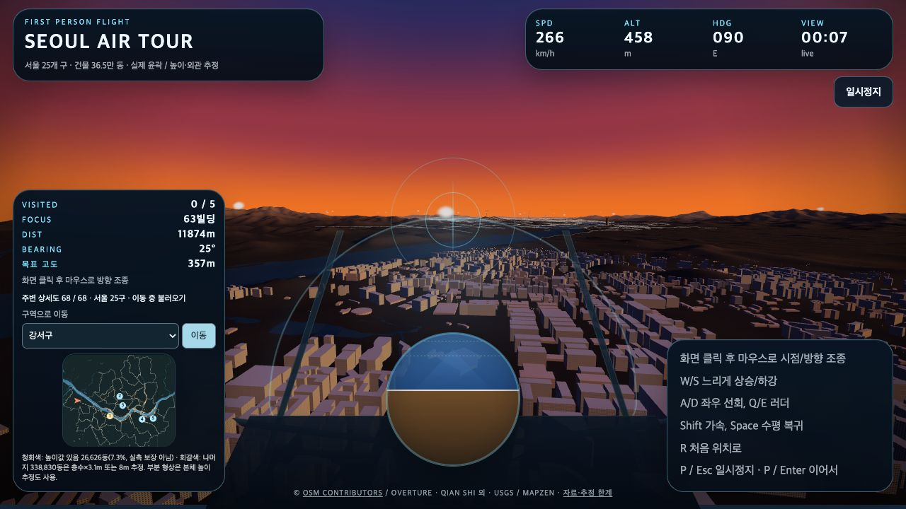
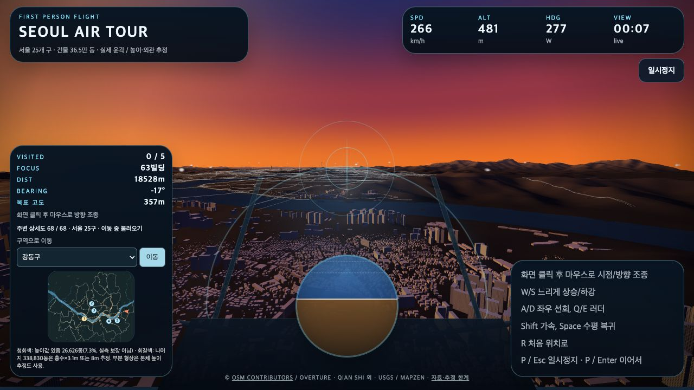

# Seoul Air Tour Viewer

<!-- PROJECT-LINKS:START -->
## 3D Playground

게임·공간·아바타를 한곳에서. 카드를 누르면 저장소로, 아래 버튼을 누르면 공개 데모 또는 실행 안내로 이동합니다.

<table>
<tr>
<td width="50%" valign="top">
<a href="https://github.com/minwoo19930301/seoul-flight-game"></a><br>
<a href="https://minwoo19930301.github.io/seoul-flight-game/"></a>
<a href="https://github.com/minwoo19930301/seoul-flight-game/pulls"></a><br>
<sub>공개 데모는 이전 중심부 · 서울 25구 확장은 최신 PR</sub><br>
<sub><a href="https://github.com/minwoo19930301/seoul-flight-game">저장소</a> · <a href="https://github.com/minwoo19930301/seoul-flight-game/pull/1">병합된 개선 PR #1</a></sub>
</td>
<td width="50%" valign="top">
<a href="https://github.com/minwoo19930301/parking-master-webasm"></a><br>
<a href="https://parking-master-webasm.vercel.app/"></a>
<a href="https://github.com/minwoo19930301/parking-master-webasm/pulls"></a><br>
<sub>공개 데모는 이전 버전 · 최신 소스는 저장소</sub><br>
<sub><a href="https://github.com/minwoo19930301/parking-master-webasm">저장소</a> · <a href="https://github.com/minwoo19930301/parking-master-webasm/pull/2">병합된 개선 PR #2</a></sub>
</td>
</tr>
<tr>
<td width="50%" valign="top">
<a href="https://github.com/minwoo19930301/interior3d"></a><br>
<a href="https://minwoo19930301.github.io/interior3d/"></a>
<a href="https://github.com/minwoo19930301/interior3d/pulls"></a><br>
<sub>공개 데모는 이전 버전 · 19종 모델은 최신 소스</sub><br>
<sub><a href="https://github.com/minwoo19930301/interior3d">저장소</a> · <a href="https://github.com/minwoo19930301/interior3d/pull/1">병합된 개선 PR #1</a></sub>
</td>
<td width="50%" valign="top">
<a href="https://github.com/minwoo19930301/animal-metaverse"></a><br>
<a href="https://minwoo19930301.github.io/animal-metaverse/"></a>
<a href="https://github.com/minwoo19930301/animal-metaverse/pulls"></a><br>
<sub>3D 3종 + 2D 3종 · 아래에서 바로 선택</sub><br>
<sub><a href="https://github.com/minwoo19930301/animal-metaverse">저장소</a> · <a href="https://github.com/minwoo19930301/animal-metaverse/pull/1">병합된 개선 PR #1</a></sub>
</td>
</tr>
<tr>
<td width="50%" valign="top">
<a href="https://github.com/minwoo19930301/flamingo-chess"></a><br>
<a href="https://minwoo19930301.github.io/flamingo-chess/"></a>
<a href="https://github.com/minwoo19930301/flamingo-chess/pulls"></a><br>
<sub>플라밍고 vs 흑조 · AI 대국</sub><br>
<sub><a href="https://github.com/minwoo19930301/flamingo-chess">저장소</a> · <a href="https://github.com/minwoo19930301/flamingo-chess/pull/1">병합된 개선 PR #1</a></sub>
</td>
<td width="50%" valign="top">
<a href="https://github.com/minwoo19930301/animal-hood-girl-vtuber"></a><br>
<a href="https://github.com/minwoo19930301/animal-hood-girl-vtuber#실행"></a>
<a href="https://github.com/minwoo19930301/animal-hood-girl-vtuber/pulls"></a><br>
<sub>macOS 로컬 앱 · 웹 플레이 링크 없음</sub><br>
<sub><a href="https://github.com/minwoo19930301/animal-hood-girl-vtuber">저장소</a> · <a href="https://github.com/minwoo19930301/animal-hood-girl-vtuber/pull/1">병합된 개선 PR #1</a></sub>
</td>
</tr>
<tr>
<td width="50%" valign="top">
<a href="https://github.com/minwoo19930301/flamingo-arcade-2"></a><br>
<a href="https://github.com/minwoo19930301/flamingo-arcade-2#로컬에서-실행"></a>
<a href="https://github.com/minwoo19930301/flamingo-arcade-2"></a><br>
<sub>2D 패러디 8종 + 로우폴리 3D 대전 · 코드만 공개, 미배포</sub>
</td>
<td width="50%" valign="top">
<h3>두 번째 플라밍고 게임 서랍</h3>
<p>라면 · 부적 · 전대 · 철거 · 가상 바탕화면 · 폐차 · 흑백 격투 · 로켓슛 · 장외 대전</p>
<a href="https://github.com/minwoo19930301/flamingo-arcade-2#카트리지-서랍"></a>
<a href="https://github.com/minwoo19930301/flamingo-arcade-2/blob/main/docs/visual-references.md"></a>
</td>
</tr>
</table>

### ANIMALVERSE · 여섯 세계 바로가기

<p>
<a href="https://minwoo19930301.github.io/animal-metaverse/versions/3d/"></a>
<a href="https://minwoo19930301.github.io/animal-metaverse/versions/3d-r3f/"></a>
<a href="https://minwoo19930301.github.io/animal-metaverse/versions/3d-babylon/"></a>
<a href="https://minwoo19930301.github.io/animal-metaverse/versions/2d-pixel/"></a>
<a href="https://minwoo19930301.github.io/animal-metaverse/versions/2d-pastel/"></a>
<a href="https://minwoo19930301.github.io/animal-metaverse/versions/2d-iso/"></a>
</p>

<sub>2026-09-07 확인: 공개 데모 5곳과 ANIMALVERSE 세부 경로 6곳은 HTTP 응답 확인. 화면·조작 검증을 뜻하지 않습니다. 위 개선 PR 6개는 병합됐습니다. Interior3D 공개 데모는 이전 배포이며, Driving Practice 공개 데모의 최신 확장 반영도 확인되지 않았습니다. “최신 PR”에는 병합 전 변경이 포함될 수 있습니다.</sub>

<!-- PROJECT-LINKS:END -->

서울 25개 구의 공개 건물 윤곽을 거리별로 불러오는 비행 지도입니다. **전체 행정구역 자료를 연결했지만, 서울 전체의 실측·실사 복원을 완료한 것은 아닙니다.** 공개 데모에 이 변경이 배포됐다는 뜻도 아닙니다.

- 건물 **365,456동 + 부분 형상 1,684개**, 원본 GERS/OSM 식별자·중정·출처·높이 결측 보존.
- 실제 서울 경계 bbox **37.0 × 30.4km**, 25개 구 이동 선택과 전역 미니맵.
- 실제 DEM **824 × 677표본**, 한강·호수 등 **548개 수면 / 121개 구멍**.
- 1km **657개 압축 청크**를 Web Worker에서 가까운 순서로 생성. 원본 14MB 지도와 과거 래스터를 시작 시 읽거나 넓혀 늘리지 않습니다.
- 별도 참고 모델 5곳 안내: 63빌딩 → 경복궁 → N서울타워 → COEX → 롯데월드타워. 완료 후에도 서울 전역 자유 비행을 계속할 수 있습니다.

높이값이 있는 일반 건물은 **26,626동(7.3%)**이며, 그 값도 실측을 보장하지 않습니다. 나머지는 화면에서 추정으로 구분해 층수 × 3.1m 또는 8m로 표시합니다. 부분 형상에는 본체 높이 추정도 사용합니다. 창·재질·평지붕은 일반화한 표현이며 실제 건물의 외관이 아닙니다. 전역 도로·교량·식생·실사 텍스처는 미확보입니다.

[전체 자료·수량·높이 정책·제외 사유·정확도 한계](docs/full-seoul-data.md) · [CPU 전수 검사](docs/full-city-validation.json) · [데이터 라이선스](assets/full-seoul/source/ATTRIBUTION.md)

### 실제 로컬 화면

<table><tr>
<td width="50%"><a href="docs/browser-verification-20260907.md"></a><br><b>강서구 · 서울 서쪽</b></td>
<td width="50%"><a href="docs/browser-verification-20260907.md"></a><br><b>강동구 · 서울 동쪽</b></td>
</tr></table>

25개 구 이동과 주변 로딩은 [실제 브라우저에서 확인](docs/browser-verification-20260907.md)했습니다. 사진처럼 복원한 도시가 아니라 실제 윤곽에 공개 높이 또는 명시적 추정을 얹은 지도입니다. 공개 데모는 아직 이전 버전입니다.

## 실행

```sh
python3 -m http.server 5174 --bind 127.0.0.1
```

저장소 루트에서 실행한 뒤 `http://127.0.0.1:5174`를 엽니다. 별도 API 키, 계정, 외부 지도 호출은 필요 없습니다. ES modules, WebGL2, module Worker, DecompressionStream을 지원하는 브라우저가 필요합니다.

## 조작

- 화면 클릭: 포인터 락 / 마우스 조종. W/S 또는 ↑/↓: 상승·하강, A/D 또는 ←/→: 좌우 선회.
- Q/E: 러더, Shift: 가속, Space: 수평 복귀.
- P 또는 Esc: 일시정지, P 또는 Enter: 재개. R: 처음 위치 및 실패한 건물 청크 재시도.
- **구역으로 이동**: 서울 25개 구의 실제 경계 내부 대표 지점으로 이동합니다. 안내 순서는 유지됩니다.
- 모바일: 화면의 기수·뱅크·러더·BOOST·LEVEL 버튼. 구역 이동은 HUD 안에 있습니다.
- 다른 탭으로 이동하면 자동 정지합니다. 5곳 안내가 끝나면 완료 화면의 **서울 전역 자유 비행**을 누르세요.

고도·거리·속도는 동일한 로컬 미터 좌표를 사용합니다. 항공 안전이나 실제 운항용이 아닙니다. 비행 하한은 `max(원본 DEM, 표시용 지형 LOD, 해발 0) + 18m`인 게임 안전 정책입니다. 건물 충돌은 구현하지 않아 건물 내부를 통과할 수 있습니다.

## 검증 및 정적 빌드

```sh
npm test
npm run test:full-city
npm run test:assets
npm run build
```

58개 CPU 테스트: 실제 비행 함수로 20/60/120Hz에서 5곳 연속 방문, 전역 좌표·25구 이동·높이 결측·지붕 구멍·거리별 로딩·지형 하한과 압축 worker 경로·오류 복구를 검사합니다. 부착/정리 예외, 작업자 시간 초과 재생성, 오래된 요청과 bfcache 복원도 검사합니다. 별도 전수 검사는 657개 청크의 원본 해시, 모든 렌더 형상·삼각형·법선과 전체 수면을 검사합니다. 기존 204개 GLB도 과거 자산 회귀 검사로 보존하며 새 앱은 이를 읽지 않습니다.

`npm run build`는 로컬 `dist/`에 공개 allowlist를 복사하고 상대 모듈 경로·문법·파일 크기를 검사합니다. 과거 14MB 지도·래스터·204개 도심 GLB는 빌드에서 제외합니다. 데이터 라이선스 준수를 위해 원본 추출 데이터는 포함하지만 시작 요청에 넣지 않습니다. 빌드는 배포가 아닙니다.

실제 로컬 브라우저에서 WebGL 표시, 25개 구의 이동·로딩 완료, 미니맵·일시정지를 확인했습니다. [검증 범위와 실제 캡처](docs/browser-verification-20260907.md)를 참고하세요. 물리적 모바일 기기·전체 건물 대조·기기별 FPS는 미검증입니다. `tests/browser.mjs`의 경로/완료 계약은 갱신했지만 이 자동화 파일은 실행하지 않았으며 실제 UI 검증은 별도로 수행했습니다.

## 주요 파일

- `seoul-flight.mjs`, `index-seoul-flight.html`, `seoul-flight.css`: 앱·비행·HUD·미니맵.
- `city-worker*.mjs`, `city-geometry.mjs`, `city-stream.mjs`: 비동기 압축 해제·실제 윤곽/중정 삼각화·근거리/원거리 구분·자원 회수.
- `terrain-lod.mjs`, `terrain-model.mjs`: 표시 상세도와 원본 충돌 표면의 구분.
- `assets/full-seoul/`: 신규 자료·657개 청크·메타데이터·출처.
- `scripts/prepare-full-seoul.py`: 보존 원본만으로 재현 가능한 오프라인 생성기.
- `docs/reconstruction.md`: 이전 중심 구역 모델의 역사적 참고 자료.

공개 사이트: [GitHub Pages](https://minwoo19930301.github.io/seoul-flight-game/) · [최신 PR](https://github.com/minwoo19930301/seoul-flight-game/pulls)
