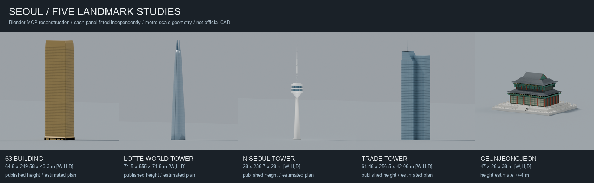

# 서울 재구성: 출처와 한계

기존 재구성 PR #1은 2026-09-07 확인 시 병합됐고 GitHub Pages는 해당 main 빌드를 표시했습니다. 후속 PR의 미병합 변경까지 공개됐다는 뜻은 아닙니다. 공식 건축 모델·측량·항공 시뮬레이터가 아닙니다. **현재 범위는 서울 전역이 아닌 W126.92/E127.11/S37.50/N37.59의 중심 구역**입니다. [서울 전역 데이터 확보·정확도 조건](full-seoul-data.md)을 별도로 기록합니다.

지도 범위만 넓혀 기존 지형·도시·래스터를 재사용하지 못하도록 시작 시 bbox·단위·축척·수량 계약을 검사합니다. 범위 밖 랜드마크도 지형 가장자리 높이로 조용히 배치하지 않고 거부합니다. 기존 500m의 명시적인 비행 패딩은 그대로이며 실제 자료 범위 확장으로 계산하지 않습니다.

## 축척과 지형

기존 지도는 가로1m를약0.1717단위로 줄이면서 건물 높이는 거의 그대로 사용했습니다. 이제 경도·위도에서 동쪽X, 위쪽Y, 남쪽Z의 로컬 미터 좌표로 변환합니다. 따라서 높이·수평거리·속도 환산에 같은 미터 단위를 사용합니다. 기준위도에서 보정한 국소 Mercator 근사이며 정밀 측량 투영은 아닙니다.

지형은 [AWS Terrain Tiles](https://registry.opendata.aws/terrain-tiles/)의 SRTM/GMTED 기반 Terrarium9타일을 복호화해257×257표본으로 보존했습니다. 약30m 원자료를 재표본화한 과거 합성자료이며 건물/식생 반사와 낮은 해상도 오차가 있습니다. 숫자 소수점은 저장 정밀도이지 측량 정확도가 아닙니다. 렌더 지면과 건물·수면 배치는 같은 SW–NE 삼각면 보간을 사용합니다. 지도 밖500m 패딩은 가장자리 값을 고정한 연습 공간입니다.

## 한강과 수면 경계

기존 자료에 빠져 있던 한강 본류는 2026-09-06 OSM 스냅샷의 relation152336·3769500으로 보완했습니다. 전체 수면206개 polygon과41개 구멍을 보존하며 한강 본류의 섬8개를 물로 덮지 않습니다. 겹치는 원본 수면은 실제 합집합으로 정리했습니다. 자체 교차한 비한강 원본3개는 임의 수선 없이 제외하고 [출처와 제외 사유](../assets/water/provenance.json)에 기록했습니다. 출처별 지형은 [필터링한 원본 형상](../assets/water/water-source-features.geojson)에 별도로 보존합니다.

수면은 지형 삼각면 위0.3m에 놓은 시각화입니다. 실제 날짜의 수위·수평 수면 측량이 아니며 낮은 해상도의 지형 자료 때문에 수면 높이도 변할 수 있습니다. 강 중심선에 임의 폭을 주거나 섬을 채우는 방식은 사용하지 않습니다.

## 다섯 랜드마크

실제 Blender MCP로 만든 오리지널 GLB를 사용합니다. 원본 사진을 텍스처로 복사하지 않았습니다. 폭·깊이·창 간격·재질·소규모 구조는 참고자료 기반의 추정입니다.

| 모델 | 높이 | 근거와 구분 |
|---|---:|---|
|63빌딩|249.58m|[서울역사박물관](https://museum.seoul.go.kr/archive/archiveNew/NR_archiveView.do?ctgryId=CTGRY489&fileId=H-TRNS-102535-491&fileSn=300&type=A&upperNodeId=CTGRY491) 공개 높이; 미확인 안테나 제외|
|롯데월드타워|555m|[설계사 KPF](https://www.kpf.com/project/lotte-world-tower); 갈라진 crown 포함, 별도 뾰족탑 없음|
|N서울타워|236.7m|[운영사](https://www.nseoultower.co.kr/global/intro2.asp)의 본체135.7+철탑101m|
|트레이드타워|256.5m|[CTBUH/CVU](https://www.skyscrapercenter.com/building/trade-tower/1141)의 지붕228m/끝256.5m; COEX 전시장과 구별|
|경복궁 근정전|26m 추정|월대 포함 약±4m 추정. [국가유산청 건축 안내](https://royal.khs.go.kr/ROYAL/contents/R311050000.do) 참고. 경복궁 전체 복원이 아님|

N서울타워의 지반 고도는 운영사270m와 서울시243m 자료가 충돌합니다. 이 장면은 어느 쪽도 측량 정답으로 강제하지 않고 DEM 표면에 배치합니다. 63빌딩의 공개 해발 고도와 DEM도 일치한다고 보장하지 않습니다. 상세 출처·좌표 수정·추정 범위는 [references.json](../assets/landmarks/references.json), 실제 치수·모델 SHA는 [manifest.json](../assets/landmarks/manifest.json)에 있습니다.

## 일반 건물

기존 OSM69,720동 중 지정한 랜드마크4개만 대체하고69,716동을204개의1km 타일로 묶었습니다. 회전·오목한 윤곽을 보존하며 축 정렬 상자로 대체하지 않습니다. 원본의 높이 출처 구분이 사라져 모든 일반 건물 높이는 **추정**으로 취급합니다. 창문·외장은 오리지널 반복 텍스처의 일반적 표현이며 실제 사진과의 일치를 주장하지 않습니다.

평탄한 각 건물 바닥은 중심점의 DEM 표면에 놓고, 낮은 지형 쪽 벽은 아래로 연장합니다. 높은 지형과 낮게 추정된 지붕이 교차하는 사례는 [city manifest](../assets/city/manifest.json)의 warnings에 공개하고 높이를 임의로 올리지 않았습니다. 현재 GPU 성능·전체 건물 시각 품질·현장 일치는 검증되지 않았습니다.

현재 위치에서3.5km 이내 타일을4개씩 불러오며4.5km 밖 타일의 GPU 자원을 해제합니다. 총 도시 파일 약80MB를 한꺼번에 초기 다운로드하지 않습니다. 실패한 구역은 화면에 표시하고 R로 재시도합니다. 인위적 지도 가장자리 마천루와 임의 산 봉우리, 근거 없는 다리 주탑은 제거했습니다.

## 검증과 재현

- `npm test`: 좌표·조작·타일 취소/재시도·실제 지형/수면 접합·원본 GLB 로더/치수/고도 CPU 검사
- 추가 CPU 검사는 실제 지리 설정·비행·경계·체크포인트 함수에20/60/120Hz 연속 키보드 입력을 넣어5곳 도달을 확인합니다. 시험용 조종만 사용하며 초기화 이후 위치/방향을 순간 변경하지 않습니다. 카메라는 Three.js CPU 객체이며 DOM·이벤트·GPU 렌더링은 이 검사에서 제외합니다. 앱에 자동조종 기능을 추가하지 않았습니다.
- `npm run test:assets`: 전체204타일 바이너리·인덱스·법선·소스ID·좌표·SHA 검사
- `node scripts/generate-city-glbs.mjs`: 저장된 OSM 및 DEM과 공통 지면 보간으로 타일 재생성
- `node scripts/validate-city-glbs.mjs --reproduce`: 재생성 후 모든 타일 SHA가 동일한지 검증
- [Blender 원본](../assets/reference-source/landmarks/seoul-landmarks.blend):5개 모델 collection. 저장본 재개방 후 재수출5/5 전체파일 동일, Khronos 오류/경고0

이 기록은 새 브라우저·WebGL·수동 비행·모바일 실기기 테스트가 아닙니다. 원본 지형 제공·법적 출처의 상세 한계는 각 JSON에 보존합니다. OSM은 © OpenStreetMap contributors/[ODbL](https://www.openstreetmap.org/copyright), SRTM/GMTED는 USGS/Mapzen 출처를 유지합니다.

현재 건물 스트리밍 반경3.5/4.5km와 안개 시작6km가 달라 이동 중 구역 출현/제거가 보일 수 있습니다. 실제 시각적 강도·로딩 성능과 페이드 방식은 브라우저 검증이 필요한 잔여 항목입니다. 미니맵은 CSS 고정 높이를 제거해 지리 종횡비를 유지하며, 목표 고도는 정수 미터로 표시해 DEM 소수점의 허위 정밀도를 노출하지 않습니다.
